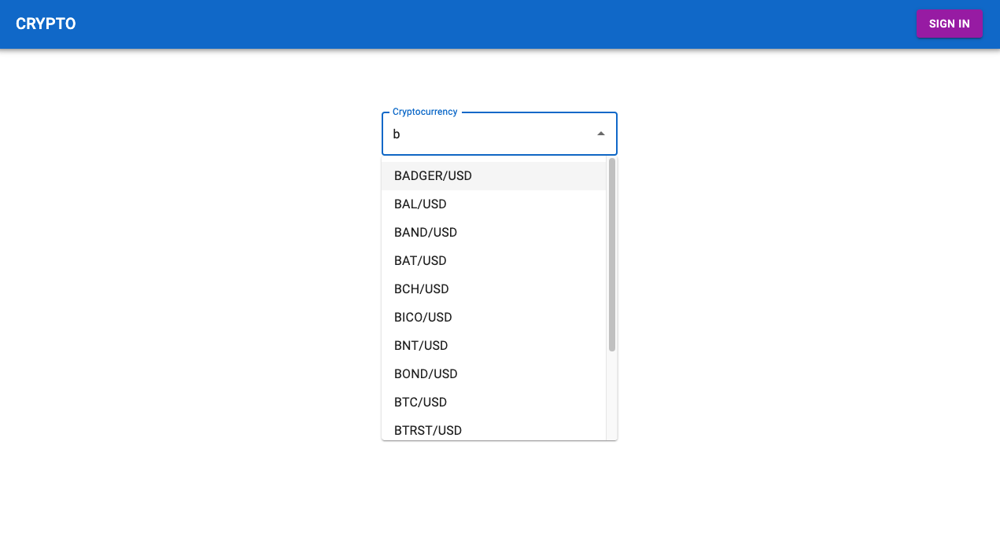
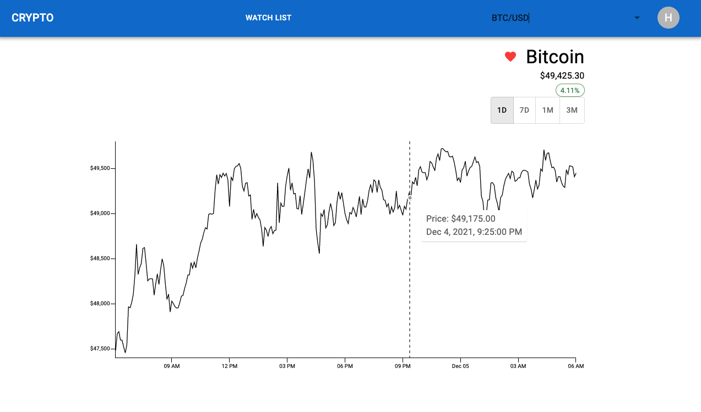
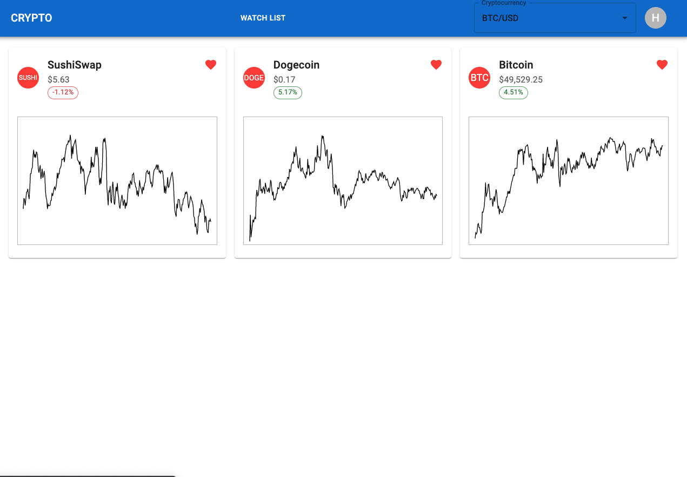

# CRYPTO

## Overview
For my project, I created a Crypto investment platform to show a cryptocurrency's details. Users can search for a cryptocurrency and it to a watch list. Users can view crypocurrencies one at a time or compare multiple. 


A user can look up a cryptocurrency in a search bar/dropdown. 

See details including up-to-date price, percent change, and a line graph of the past 24 hours. The timeframe of the line graph can be changed to 7 days, 1 month, and 3 months. If the user is logged in, the user can click a heart to add/remove the cryptocurrenty from their watch list. 

A user can view their watch list and can remove cryptocurrencies. 

## User Stories:
Users will be able to:
- Search for Cryptocurrency via search/dropdown
- Create a new user
- Login/Logout
- Delete account
- View Cryptocurrency's details
- Click on a heart to add Cryptocurrency to Watch List
- View Watch List

## Technologies
Project is created with:
- React 17.0.2
- React-Router-Dom 6.0.2
- Material UI @mui/material 5.2.0
- Visx
- Typescript 4.5.2
- Express 4.17.1
- Node 15.11.0

## Launch
Run the backend:

```
cd backend/
$ yarn install
$ yarn start
```
Run the frontend:
```
cd frontend/
$ yarn install
$ yarn start
```

## Live Site
<a href="https://crypto-investment-platform.netlify.app/" target="_blank">CRYPTO</a>

## Endpoints
- GET users/:id
- POST users/
#### Payload
```
    { 
    firstName: string
    lastName: string
    email: string
    password: string
    confirm: string 
    }
```
#### Response
```
    {
    result:{
        name: string
        email: string
        password : string(hashed)
        watchList: string[]
        _id: string
    }
    token: string
    }
```
- PATCH users/:id
- DELETE users/:id
- POST users/signin
- POST users/signup

### 3rd Party API
wss://ws-feed.exchange.coinbase.com
https://api.pro.coinbase.com/products
https://api.pro.coinbase.com/currencies/:currencyCode
https://api.pro.coinbase.com/products/:pairId/candles

## Models
- User:
    - name: string
    - email: string
    - password: string
    - watchList: string[]
    - id: string

## Component Tree
- App
    - NavBar
        - AutoDropdown - autocomplet text input/dropdowm
        - ConfirmDialog - reusable dialog box
    - Home - renders Home view
        - AutoDropdown
    - Currency - renders cryptocurrency view
        - MainGraph - displays line graph
            - Axis - displays axis for line graph
        - ConfirmDialog
    - WatchList - renders watch list view
        - WatchCard - cryptocurrency card
            - MainGraph
            - ConfirmDialog
    - Auth - form for signin/signup
        - ConfirmDialog
        - Input - reusable text input

## Architechture Pattern
I used the MVVM pattern. I had many components that only displayed the data they were given. I had other components that recieved the data from the backend or 3rd party API and transformed it for consumption by the views.
